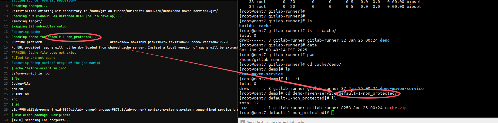

# cache example

**gitlab-ci.yml**
```
before_script:
  - echo "before-script!!"

variables:
  GIT_DEPTH: 0
  GIT_CLEAN_FLAGS: '-ffdx'
  DOMAIN: example.com

cache:
  paths:
    - target/

stages:
  - build
  - test
  - deploy

build:
  before_script:
    - echo "before-script in job"
  stage: build
  tags:
    - build
  only:
    - develop
    - main
  script:
    - ls
    - id
    - mvn clean package -DskipTests
    - ls target
    - echo "$DOMAIN"
    - false && true ; exit_code=$?
    - if [ $exit_code -ne 0 ]; then echo "Previous command failed"; fi;
    - sleep 2;
  after_script:
    - echo "after script in job"

unittest:
  stage: test
  tags:
    - build
  only:
    - develop
    - main
  script:
    - echo "run test"
    - echo 'test' >> target/a.txt
    - ls target
  retry:
    max: 2
    when:
      - script_failure

deploy:
  stage: deploy
  tags:
    - build
  only:
    - develop
    - main
  script:
    - echo "run deploy"
    - ls target
  retry:
    max: 2
    when:
      - script_failure

after_script:
  - echo "after-script"
```
pipeline的运行结果是ok的


下面来分别看下三个job的执行情况，以及cache的执行情况
* 每个job在开始和结束时，都会执行cache相关的操作
* 开始时，会下载cache(pull)
* 结束时，会上传cache(push)

## build job
在build job开始时，没有cache；所以此时没法下载cache(pull)


在build job成功后，cache被创建；所以此时上传cache(push)


那么cache会被保存在哪里呢？保存在gitlab的runner上，可以登录到runner上查看


可关注下这里cache的名称，


## unittest job
* 在unittest job开始时，有cache；所以此时可以下载cache(pull)
* 在unittest job成功后，因为target目录发生变化，所以此时需要重新创建cache(push)；如果target目录没有发生变化，则不会重新创建cache(push)


## deploy job
* 因为target目录没有发生变化，所以此时没有更新cache的操作，即push


## rebuild with cache
如果重新build，可以利用cache，从而加快build的速度


