# pipeline syntax

常用语法
* tags
* alllow_failure
* when
* retry
* timeout
* parallel
* only
* except
* rules
* workflow

## 1 tags
让job在指定runner上运行;通过这种方式，可以让job在不同的平台上运行，比如Windows、Linux、Mac等

```
build:
  stage: build
  tags:
    - build
  only: # limit the branch
    - main
  script:
    - echo "maven clean"
    - echo "maven install"
```

## 2 alllow_failure
allow_failure 允许作业失败，默认值为 false。启用后，如果作业失败，该作业将在用户界面中显示橙色警告。但是，管道的逻辑流程将认为作业成功/通过，并且不会被阻塞。假设所有其他作业均成功，则该作业的阶段及其管道将显示相同的橙色警告。但是，关联的提交将被标记为“通过”，而不会发出警告
* 如果后面有job的when条件为on_success，即使该job失败了，也不影响后面when为on_success的job执行

```
stages:
  - build
  - test
  - deploy

build:
  stage: build
  tags:
    - build
  only: # limit the branch
    - main
  script:
    - echo "maven clean"
    - echo "maven install"

unittest:
  stage: test
  tags: 
    - build
  script:
    - ech "run test"
  allow_failure: true

deploy:
  stage: deploy
  tags:
    - deploy
  only:
    - main
  script:
    - echo "hello deploy"
```


## 3 when
控制作业的执行

* on_success 前面阶段中的所有作业都成功时才执行作业，默认值。

* on_failure 当前面阶段出现失败时执行。

* always 总是执行作业。

* manual 手动执行作业。

* delayed 延迟执行作业。


```
stages:
  - build
  - test
  - deploy
  - codescan

build:
  stage: build
  tags:
    - build
  only: # limit the branch
    - main
  script:
    - echo "maven clean"
    - echo "maven install"

unittest:
  stage: test
  tags: 
    - build
  script:
    - ech "run test"
  when: delayed
  start_in: "10"
  allow_failure: true

deploy:
  stage: deploy
  tags:
    - deploy
  only:
    - main
  script:
    - echo "hello deploy"
  when: manual

codescan:
  stage: codescan
  tags:
    - deploy
  only:
    - main
  script:
    - echo "codescan"
    - sleep 5
  when: on_success

```

* deploy需要手动执行


## 4 retry

* 配置在失败的情况下重试作业的次数。

* 当作业失败并配置了 retry，将再次处理该作业，直到达到 retry 关键字指定的次数。

* 如果 retry 设置为 2，并且作业在第二次运行成功（第一次重试），则不会再次重试。retry 值必须是一个正整数，等于或大于 0，但小于或等于 2（最多两次重试，总共运行 3 次）

```
stages:
  - build
  - test
  - deploy
  - codescan

build:
  stage: build
  tags:
    - build
  only: # limit the branch
    - main
  script:
    - echo "maven clean"
    - echo "maven install"

unittest:
  stage: test
  tags: 
    - build
  script:
    - ech "run test"
  when: delayed
  start_in: "10"
  allow_failure: false
  retry: 2

deploy:
  stage: deploy
  tags:
    - deploy
  only:
    - main
  script:
    - echo "hello deploy"
  when: manual

codescan:
  stage: codescan
  tags:
    - deploy
  only:
    - main
  script:
    - echo "codescan"
    - sleep 5
  when: on_success
```


失败后，后面的job不会执行


## 5 retry-重试-精确匹配错误

默认情况下，在失败情况下重试作业。max：最大重试次数， when：重试失败的错误类型
* always：在发生任何故障时重试（默认）。

* unknown_failure：当失败原因未知时。

* script_failure：脚本失败时重试。

* api_failure：API失败重试。

* stuck_or_timeout_failure：作业卡住或超时时。

* runner_system_failure：运行系统发生故障。

* missing_dependency_failure：如果依赖丢失。

* runner_unsupported：Runner不受支持。

* stale_schedule：无法执行延迟的作业。

* job_execution_timeout：脚本超出了为作业设置的最大执行时间。

* archived_failure：作业已存档且无法运行。

* unmet_prerequisites：作业未能完成先决条件任务。

* scheduler_failure：调度程序未能将作业分配给运行scheduler_failure。

* data_integrity_failure：检测到结构完整性问题。

```
stages:
  - build
  - test
  - deploy
  - codescan

build:
  stage: build
  tags:
    - build
  only: # limit the branch
    - main
  script:
    - echo "maven clean"
    - echo "maven install"

unittest:
  stage: test
  tags: 
    - build
  script:
    - ech "run test"
  when: delayed
  start_in: "5"
  allow_failure: true
  retry:
    max: 1
    when: script_failure

deploy:
  stage: deploy
  tags:
    - deploy
  only:
    - main
  script:
    - echo "hello deploy"
  when: manual

codescan:
  stage: codescan
  tags:
    - deploy
  only:
    - main
  script:
    - echo "codescan"
    - sleep 5
  when: on_success
```


## 6 timeout

作业级别(job)的超时可以超过项目级别的超时，但不能超过Runner特定的超时

* 作业级别的超时
```
build:
    stage: build
    script:
        - echo "build"
        - sleep 10
    timeout: 1 hour 10 minutes
```

* 项目级别的超时


## 7 parallel - 并行作业

* 配置要并行运行的作业实例数，此值必须大于或等于 2 并且小于或等于 50。

* 这将创建 N 个并行运行的同一作业实例。它们从 job_name 1/N 到 job_name N/N 依次命名。

```
stages:
  - build
  - test
  - deploy
  - codescan

build:
  stage: build
  tags:
    - build
  only: # limit the branch
    - main
  script:
    - echo "maven clean"
    - echo "maven install"

unittest:
  stage: test
  tags: 
    - build
  script:
    - echo "run test"
  when: delayed
  start_in: "5"
  allow_failure: true
  retry:
    max: 1
    when: script_failure

deploy:
  stage: deploy
  tags:
    - deploy
  only:
    - main
  script:
    - echo "hello deploy"
  when: manual

codescan:
  stage: codescan
  tags:
    - deploy
  only:
    - main
  script:
    - echo "codescan"
    - sleep 5
  when: on_success
  parallel: 5
```


## 8 only & except - 限制分支标签
only 和 except 用分支策略来限制 jobs 构建：

* only 定义哪些分支和标签的 git 项目将会被 job 执行。

* except 定义哪些分支和标签的 git 项目将不会被 job 执行。

```
job:
    # use regexp
    only:
        - /^issue-.*$/
    # use specicial keywords
    except:
        - branches
```

only & except案例
```
stages:
  - build
  - test
  - deploy
  - codescan

build:
  stage: build
  tags:
    - build
  only: # limit the branch
    - main
  script:
    - echo "maven clean"
    - echo "maven install"

unittest:
  stage: test
  tags: 
    - build
  except:
    - develop
    - devlop
  script:
    - echo "run test"
  when: delayed
  start_in: "5"
  allow_failure: true
  retry:
    max: 1
    when: script_failure

deploy:
  stage: deploy
  tags:
    - deploy
  only:
    - main
  script:
    - echo "hello deploy"
  when: manual

codescan:
  stage: codescan
  tags:
    - deploy
  only:
    - main
  script:
    - echo "codescan"
    - sleep 5
  when: on_success
  parallel: 5
```

## 8 rules - 构建规则

* rules允许按顺序评估单个规则，直到找到一个匹配的规则。
* rules不能与only和except同时使用

可用的规则
* if 如果条件匹配
* changes 指定文件发生改变
* exists 指定文件存在

### 8.1 rules - if - 条件匹配
* rules是一个数组，定义系列规则
* 如果条件匹配，则执行作业

only语句可以替换为rules语句，比如
```
only:   
    - main
```
可以替换为
```
rules:
    - if: '$CI_COMMIT_REF_NAME == "main"'
```
* 这里CI_COMMIT_REF_NAME是内置变量吗？需要掌握常见的内置变量
* 内置变量：https://docs.gitlab.com/ee/ci/variables/predefined_variables.html

**案例：**

```
variables:
  DOMAIN: example.com

codescan:
  stage: codescan
  tags:
    - build
  script:
    - echo "codescan"
    - sleep 5
  #parallel: 5
  rules:
    - if: '$DOMAIN == "example.com"'
      when: manual
    - when: on_success
```
* 如果DOMAIN的值匹配，则需要手动执行
* 不匹配on_success，默认规则
* 条件判断从上到下，匹配即停止
* 多条条件匹配可以使用&&，||

**案例：** 把only修改为rules if
* only
```
stages:
  - build
  - test
  - deploy
  - codescan

# FIX issue:
  # fatal: git fetch-pack: expected shallow list
  # fatal: The remote end hung up unexpectedly
variables:
  GIT_DEPTH: 0
  GIT_CLEAN_FLAGS: '-ffdx'

# clean the repository in the before_script section(alternative)
#before_script:
#  - git reset --hard
#  - git clean -ffdx

build:
  stage: build
  tags:
    - build
  only: # limit the branch
    - main
  script:
    - echo "maven clean"
    - echo "maven install"

unittest:
  stage: test
  tags: 
    - build
  except:
    - develop
    - devlop
  script:
    - echo "run test"
  when: delayed
  start_in: "5"
  allow_failure: true
  retry:
    max: 1
    when: script_failure

deploy:
  stage: deploy
  tags:
    - deploy
  only:
    - main
  script:
    - echo "hello deploy"
  when: manual

codescan:
  stage: codescan
  tags:
    - deploy
  only:
    - main
  script:
    - echo "codescan"
    - sleep 3
  when: on_success
  parallel: 3
```
* rules-if
```
stages:
  - build
  - test
  - deploy
  - codescan

# FIX issue:
  # fatal: git fetch-pack: expected shallow list
  # fatal: The remote end hung up unexpectedly
variables:
  GIT_DEPTH: 0
  GIT_CLEAN_FLAGS: '-ffdx'

# clean the repository in the before_script section(alternative)
#before_script:
#  - git reset --hard
#  - git clean -ffdx

build:
  stage: build
  tags:
    - build
  rules:
    - if: '$CI_COMMIT_REF_NAME == "main"'
  script:
    - echo "maven clean"
    - echo "maven install"

unittest:
  stage: test
  tags: 
    - build
  except:
    - develop
    - devlop
  script:
    - echo "run test"
  when: delayed
  start_in: "5"
  allow_failure: true
  retry:
    max: 1
    when: script_failure

deploy:
  stage: deploy
  tags:
    - deploy
  rules:
    - if: '$CI_COMMIT_REF_NAME == "main"'
  script:
    - echo "hello deploy"
  when: manual

codescan:
  stage: codescan
  tags:
    - deploy
  rules:
    - if: '$CI_COMMIT_REF_NAME == "main"'
  script:
    - echo "codescan"
    - sleep 3
  when: on_success
  parallel: 3
```

**案例：** 综合案例
* 可以在project级别，也可以在job级别，通过variables定义变量
* 在某个job中定义的变量，无法在另一个job中访问到，比如这里的MY_VARIABLE
* prechecking job的逻辑
```
stages:
  - prechecking
  - test

# FIX issue:
  # fatal: git fetch-pack: expected shallow list
  # fatal: The remote end hung up unexpectedly
variables:
  GIT_DEPTH: 0
  GIT_CLEAN_FLAGS: '-ffdx'

# clean the repository in the before_script section(alternative)
#before_script:
#  - git reset --hard
#  - git clean -ffdx

prechecking:
  stage: prechecking
  tags:
    - build
  variables:
    MY_VARIABLE: "default branch"
  rules:
    - if: '$CI_COMMIT_REF_NAME == "main"'
      variables:
        MY_VARIABLE: "main"
    - when: on_success
  script:
    - echo "$MY_VARIABLE"

unittest:
  stage: test
  tags: 
    - build
  except:
    - devlop
  script:
    - echo "$MY_VARIABLE"
    - echo "run test"
  when: delayed
  start_in: "5"
  allow_failure: true
  retry:
    max: 1
    when: script_failure
```


### 8.2 rules - changes - 指定文件发生改变
* 接收内容为文件路径的数组
* 如果文件发生改变，则执行作业
```
rules:
  - changes:
      - README.md
      - CHANGELOG.md
```

### 8.3 rules - exists - 指定文件存在
* 接收内容为文件路径的数组
* 如果文件存在，则执行作业
```
rules:
  - exists:
      - README.md
      - CHANGELOG.md
```

**案例：**
```
stages:
  - prechecking

# FIX issue:
  # fatal: git fetch-pack: expected shallow list
  # fatal: The remote end hung up unexpectedly
variables:
  GIT_DEPTH: 0
  GIT_CLEAN_FLAGS: '-ffdx'

# clean the repository in the before_script section(alternative)
#before_script:
#  - git reset --hard
#  - git clean -ffdx

prechecking:
  stage: prechecking
  tags:
    - build
  rules:
    - exists: 
      - Dockerfile
  script:
    - echo “prechecking”
```

### 8.4 rules - allow_failure
* allow_failure: true, 允许作业失败，不影响后续的作业


## 9. workflow - rules - 管道创建
* 顶级 workflow 关键字适用于整个管道，并将确定是否创建管道。

* when：可以设置为 always 或 never，如果未提供，则默认值为 always


## 10. cache
* 存储编译项目所需的运行时依赖项，指定项目工作空间中需要在 job 之间缓存的文件或目录。

* 全局 cache 定义在 job 之外，针对所有 job 生效。job 中的 cache 优先于全局


### 10.1 cache: paths
* 在 job build 中定义缓存，将会缓存 target 目录下的所有 .jar 文件。
* 当在全局定义了 cache:paths 时，会被 job 中的定义覆盖。以下实例将缓存 target 目录


### 10.2 cache:key - 缓存标记
* 为缓存做个标记，可以配置 job、分支为 key 来实现分支、作业特定的缓存。
* 为不同 job 定义了不同的 cache:key 时，会为每个 job 分配一个独立的 cache。
* cache:key 变量可以使用任何预定义变量，默认 default。
* 从 GitLab 9.0 开始，默认情况下所有内容都在管道和作业之间共享

按照分支设置缓存
```
cache:
  key: $(CI_COMMIT_REF_SLUG)
```

### 10.3 cache:key:files - 文件变化自动创建缓存
* files: 文件发生变化自动重新生成缓存（files 最多指定两个文件），提交的时候检查指定的文件。根据指定的文件生成密钥计算 SHA 校验和，如果文件(文件的md5值的名称)未改变值为 default

```
cache:
  key:
    files:
      - Gemfile.lock
      - package.json
  paths:
    - vendor/ruby
    - node_modules
```

### 10.4 cache:key:prefix - 组合生成校验和的前缀
* prefix：允许给定 prefix 的值与指定文件生成的密钥组合。
* 在这里定义了全局的 cache，如果文件发生变化则值为 rspec-xxx11111111222222，未发生变化为 rspec-default


### 10.5 cache:policy - 缓存策略
* 默认策略：pull-push在job开始执行时下载文件，并在结束时重新上传文件；这里的上传或下载是指gitlab-runner所运行的机器，比如下载就是从gitlab-runner所运行的机器下载
* policy: pull 在job开始执行时下载文件
* policy: push 在job结束时上传文件
* policy: pull-push 在job开始执行时下载文件，并在结束时重新上传文件


## 11. artifacts
用于指定在作业成功或者失败时应附件到作业的文件或目录的列表。作业完成后，工件将被推送到Gitlab，并可在Gitlab UI中下载
```
artifacts:
  paths:
    - target/
```
* 在target目录下的文件会被上传到gitlab

**案例**
```
before_script:  # 在每个job执行前执行
  - echo "before-script!!"

variables:
  GIT_DEPTH: 0
  GIT_CLEAN_FLAGS: '-ffdx'
  DOMAIN: example.com

cache:
  paths:
    - target/

stages:
  - build
  - test
  - deploy

build:
  before_script:
    - echo "before-script in job"
  stage: build
  tags:
    - build
  only:
    - develop
    - main
  script:
    - ls
    - id
    - mvn test
    - mvn cobertura:cobertura
    - ls target
    - echo "$DOMAIN"
    - false && true ; exit_code=$?
    - if [ $exit_code -ne 0 ]; then echo "Previous command failed"; fi;
    - sleep 2;
  after_script:
    - echo "after script in job"
  artifacts:
    name: "$CI_JOB_NAME-$CI_COMMIT_REF_NAME"
    when: on_success
    paths:
      - target/*.jar # 收集target目录下的jar文件
    reports:
      junit: target/surefire-reports/TEST-*.xml # 收集测试结果xml文件
      coverage_report: 
        coverage_format: cobertura
        path: target/site/cobertura/coverage.xml # 收集覆盖率xml文件
  coverage: '/Code coverage: \d+\.\d+/'

unittest:
  dependencies:
    - build
  stage: test
  tags:
    - build
  only:
    - develop
    - main
  script:
    - echo "run test"
    # - echo 'test' >> target/a.txt
    - ls target
  retry:
    max: 2
    when:
      - script_failure

deploy:
  stage: deploy
  tags:
    - build
  only:
    - develop
    - main
  script:
    - echo "run deploy"
    - ls target
  retry:
    max: 2
    when:
      - script_failure


after_script: # 在每个job结束之后执行
  - echo "after-script"
```
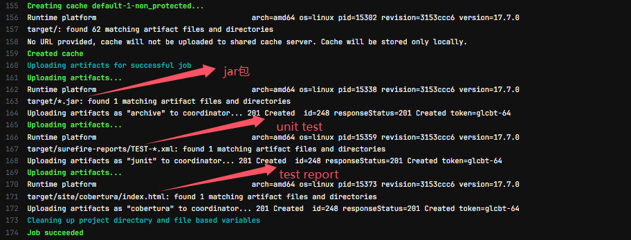

* 可以在在Gitlab UI上下载jar包、unit test report、coverage report
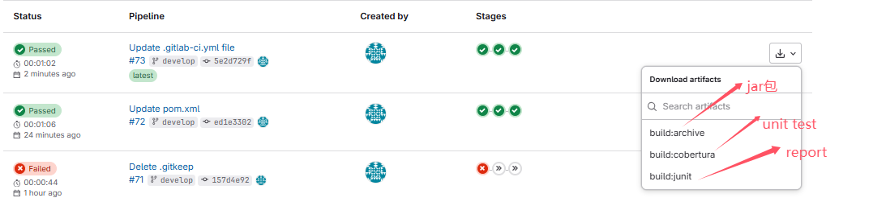
* 测试结果；如果看不到，可能是默认关闭掉了，登录gitlab-rails console, 执行`Feature.enable(:junit_pieline_view)`即可
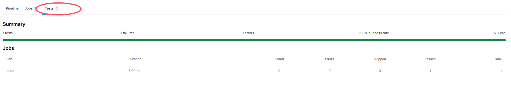

* 这些对应的文件可以在gitlab-runner的builds目录下找到

### 11.1 artifacts:expose_as 展示制品名称
关键字expose_as可以设置在UI上展示的制品名称，如果不设置，则默认使用文件名

### 11.2 artifacts:name 设置制品名称
* 不是Gitlab UI上展示的名称，以jar包为例，是生成的jar包的名称

### 11.3 artifacts:when 知名创建条件
* 用于在作业失败或成功时上传文件
   * always：总是上传
   * on_success：成功时上传, 默认值
   * on_failure：失败时上传


### 11.4 artifacts:expire_in 设置过期时间
* 设置制品的过期时间，默认是30天
* 可以使用以下单位：
  * s：秒
  * m：分钟
  * h：小时
  * d：天
  * w：周
  * y：年


### 11.5 artifacts:reports:junit 单元测试报告
* 收集junit测试报告，用于展示测试结果


### 11.6 artifacts:reports:coverage_report  代码覆盖率报告


```
[root@cent7 demo-maven-service]# pwd
/home/gitlab-runner/builds/t1_hHHu2A/0/demo/demo-maven-service
[root@cent7 demo-maven-service]# 
[root@cent7 demo-maven-service]# tree target/
target/
├── classes
│   └── com
│       └── example
│           └── App.class
├── cobertura
│   └── cobertura.ser
├── generated-classes
│   └── cobertura
│       ├── cobertura.properties
│       └── com
│           └── example
│               └── App.class
├── generated-sources
│   └── annotations
├── generated-test-sources
│   └── test-annotations
├── maven-archiver
│   └── pom.properties
├── maven-status
│   └── maven-compiler-plugin
│       ├── compile
│       │   └── default-compile
│       │       ├── createdFiles.lst
│       │       └── inputFiles.lst
│       └── testCompile
│           └── default-testCompile
│               ├── createdFiles.lst
│               └── inputFiles.lst
├── my-app-1.0-SNAPSHOT.jar
├── site
│   └── cobertura
│       ├── com.example.App.html
│       ├── css
│       │   ├── help.css
│       │   ├── main.css
│       │   ├── sortabletable.css
│       │   ├── source-viewer.css
│       │   └── tooltip.css
│       ├── frame-packages.html
│       ├── frame-sourcefiles-com.example.html
│       ├── frame-sourcefiles.html
│       ├── frame-summary-com.example.html
│       ├── frame-summary.html
│       ├── help.html
│       ├── images
│       │   ├── blank.png
│       │   ├── downsimple.png
│       │   └── upsimple.png
│       ├── index.html
│       └── js
│           ├── customsorttypes.js
│           ├── popup.js
│           ├── sortabletable.js
│           └── stringbuilder.js
├── surefire-reports
│   ├── com.example.AppTest.txt
│   └── TEST-com.example.AppTest.xml
└── test-classes
    └── com
        └── example
            └── AppTest.class

28 directories, 33 files
```
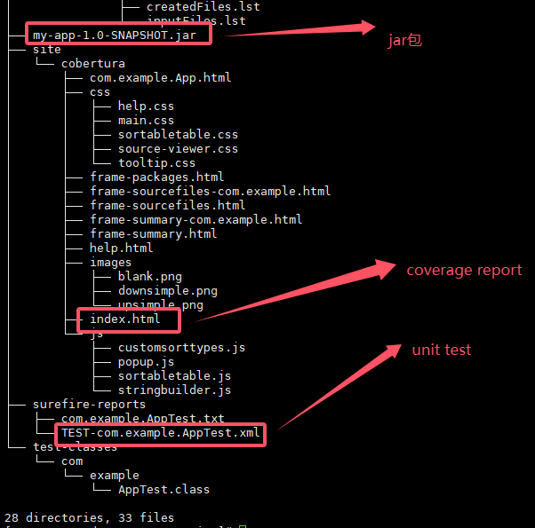

* 对于`[ERROR] Failed to execute goal org.codehaus.mojo:cobertura-maven-plugin:2.7:instrument (default-cli) on project my-app: Execution default-cli of goal org.codehaus.mojo:cobertura-maven-plugin:2.7:instrument failed: Plugin org.codehaus.mojo:cobertura-maven-plugin:2.7 or one of its dependencies could not be resolved: The following artifacts could not be resolved: com.sun:tools:jar:0: Could not find artifact com.sun:tools:jar:0 at specified path /usr/lib/jvm/java-11-openjdk-11.0.23.0.9-2.el7_9.x86_64/../lib/tools.jar -> [Help 1]`错误，需要将java版本降到java 8

## 12. dependencies - 获取制品
定义要获取工作的作业列表，只能从当前阶段之前执行的阶段定义作业。定义一个空数组将跳过下载该作业的任何工作不会考虑先前作业的状态，因此，如果它失败或是未运行的手动作业，则不会发生错误。如果设置为依赖项的作业的工作已过期或删除，那么依赖项作业将失败

```
unittest:
  dependencies:
    - build
```
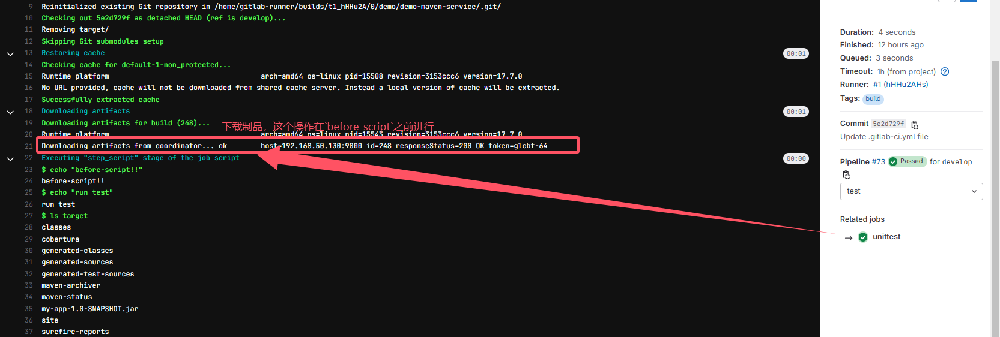
* 从哪儿下载，下载之后存放在哪里？

## 13. needs - 阶段并行(不同stage)
* 可无序执行作业，无需按照阶段顺序运行某些作业，可以让多个阶段同时运行
* 如果needs: 设置为指向因only/except规则而未实例化的作业，或者不存在，则创建管道时会出现YAML错误

**案例一**：不用needs的pipeline
```
stages:
  - build
  - test
  - deploy

module-a-build:
  stage: build
  script:
    - echo "hello3a"
    - sleep 10

module-b-build:
  stage: build
  script:
    - echo "hello3b"
    - sleep 20

module-a-test:
  stage: test
  script:
    - echo "hello3a"
    - sleep 5
#  needs: ["module-a-build"]

module-b-test:
  stage: test
  script:
    - echo "hello3b"
    - sleep 5
#  needs: ["module-b-build"]
```
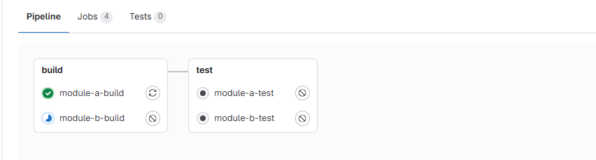

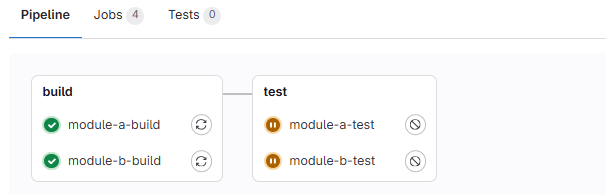

* **test job要等build job执行完才能执行**，按照stage中定义的顺序执行，先执行build，然后执行test


**案例二**：使用needs的pipeline
```
stages:
  - build
  - test
  - deploy

module-a-build:
  stage: build
  script:
    - echo "hello3a"
    - sleep 10

module-b-build:
  stage: build
  script:
    - echo "hello3b"
    - sleep 20

module-a-test:
  stage: test
  script:
    - echo "hello3a"
    - sleep 5
  needs: ["module-a-build"]

module-b-test:
  stage: test
  script:
    - echo "hello3b"
    - sleep 5
  needs: ["module-b-build"]
```
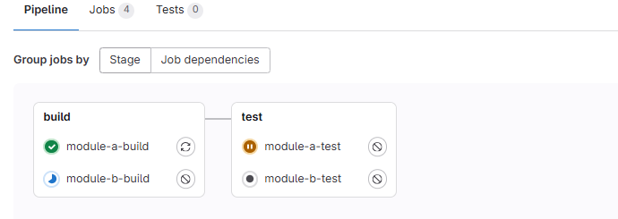

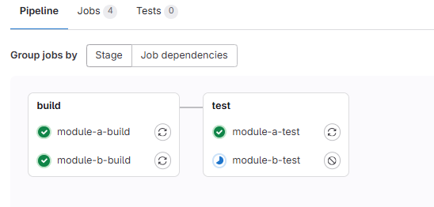

* test job可以在build job执行完之前执行，只要其依赖的build job执行完毕，已经不是按照stage里定义的build->test顺序执行了


### 13.1 needs下载制品
```
module_a_test:
  stage: test
  needs:
    - job: module_a_build # 下载指定job的制品，但是这个job要生成制品
      artifacts: true # 下载制品，同dependencies
```


## 14. include
* 可以允许引入外部YAML文件，文件具有扩展名.yml或.yaml
* 使用合并功能可以自定义和覆盖包含本地定义的CI / CD配置。
* 引入同一存储库中的文件，使用相对于根目录的完整路径进行引用，与配置文件在同一分支上使用。

### 14.1 include:local - 引入本地配置
引入**同一存储库**中的文件，使用**相对于根目录的完整路径**进行引用，与配置文件在**同一分支**上使用
```
include:
  local: 'ci/localci.yml'
```

* 文件结构

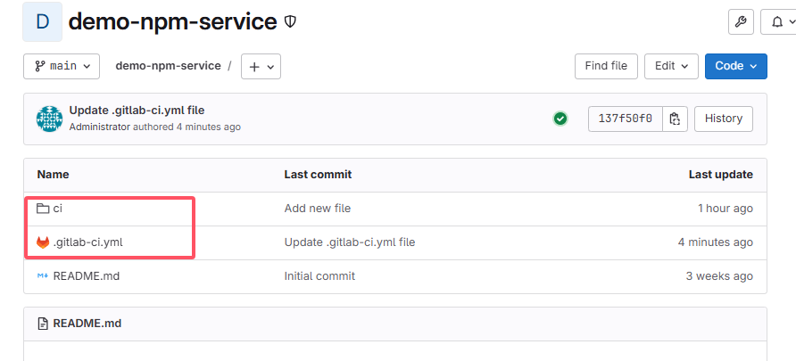

**案例一：简单引用local**
**ci/localci.yml**
```
# ci/localci.yml

deployjob:
  stage: deploy
  script: echo "deploy in the localci.yml"
```
**.gitlab-ci.yml**
```
stages:
  - build
  - test
  - deploy

include:
  local: "ci/localci.yml"  # 引入本地配置
  
module-a-build:
  stage: build
  script:
    - echo "hello3a"
    - sleep 10

module-b-build:
  stage: build
  script:
    - echo "hello3b"
    - sleep 20

module-a-test:
  stage: test
  script:
    - echo "hello3a"
    - sleep 5
  needs: ["module-a-build"]

module-b-test:
  stage: test
  script:
    - echo "hello3b"
    - sleep 5
  needs: ["module-b-build"]
```
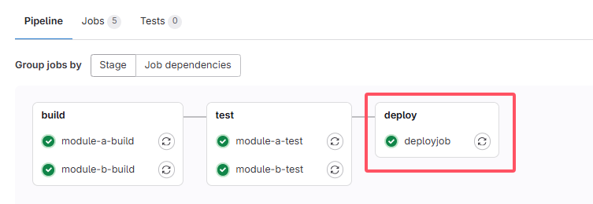

* ci/localci.yml中的deployjob被包含进来，并且与module-a-test、module-b-test平级，所以deployjob的stage为deploy，而不是test

**案例二：local中的job与.gitlab-ci.yml中的一样**
* 还是原来的ci/localci.yml
**.gitlab-ci.yml**

```
stages:
  - build
  - test
  - deploy

include:
  local: "ci/localci.yml"

deployjob:    # job与localci.yml中的job一样，但是script输出内容不同
  stage: deploy
  script: echo "deploy in the .gitlab-ci.yml"
  
module-a-build:
  stage: build
  script:
    - echo "hello3a"
    - sleep 10

module-b-build:
  stage: build
  script:
    - echo "hello3b"
    - sleep 20

module-a-test:
  stage: test
  script:
    - echo "hello3a"
    - sleep 5
  needs: ["module-a-build"]

module-b-test:
  stage: test
  script:
    - echo "hello3b"
    - sleep 5
  needs: ["module-b-build"]
```
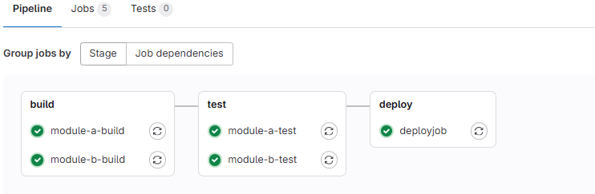

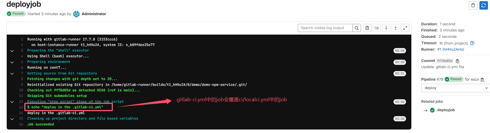

**.gitlab-ci.yml中的job会覆盖ci/localci.yml中的job**

**案例三：local中的job与.gitlab-ci.yml中有差异**

**ci/localci.yml**
```
# ci/localci.yml

deployjob:
  stage: deploy
  script: echo "deploy in the localci.yml"
  only:   # 增加了条件
    - dev
```
**.gitlab-ci.yml**
```
stages:
  - build
  - test
  - deploy

include:
  local: "ci/localci.yml"

deployjob:
  stage: deploy
  script: echo "deploy in the .gitlab-ci.yml"
  
module-a-build:
  stage: build
  script:
    - echo "hello3a"
    - sleep 10

module-b-build:
  stage: build
  script:
    - echo "hello3b"
    - sleep 20

module-a-test:
  stage: test
  script:
    - echo "hello3a"
    - sleep 5
  needs: ["module-a-build"]

module-b-test:
  stage: test
  script:
    - echo "hello3b"
    - sleep 5
  needs: ["module-b-build"]
```
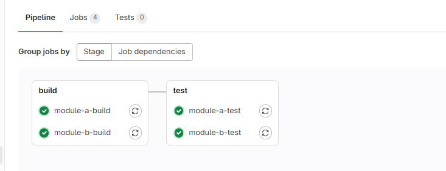
* 此时可以发现，deployjob并没有执行，二者的作业进行了合并，只有dev分支才可以执行；因为仓库只有main分支，所以这个job并没有执行


**所以，在include local job时，如果二者有一致的部分，那么.gitlab-ci.yml将会覆盖ci/localci.yml，对于不一致的部分，将会进行合并处理**

### 14.2 include:file - 包含来自另一个项目的文件
```
include:
  - project: 'demo/demo-maven-service'
    ref: 'main'
    file: 'ci/fileci.yml'
```

**案例一：** 引入demo-maven-service项目main分支的config/ci-cd.yml文件
**ci/fileci.yml**
```
# ci/fileci.yml
deployjob:
  stage: deploy
  script: echo "deploy in the fileci.yml"
```
**.gitlab-ci.yml**
```
stages:
  - build
  - test
  - deploy

include:
  - project: 'demo/demo-maven-service'  # 引入另一个仓库的文件
    ref: 'main'
    file: 'ci/fileci.yml'
  
module-a-build:
  stage: build
  script:
    - echo "hello3a"
    - sleep 10

module-b-build:
  stage: build
  script:
    - echo "hello3b"
    - sleep 20

module-a-test:
  stage: test
  script:
    - echo "hello3a"
    - sleep 5
  needs: ["module-a-build"]

module-b-test:
  stage: test
  script:
    - echo "hello3b"
    - sleep 5
  needs: ["module-b-build"]
```
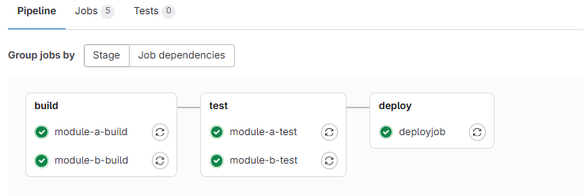

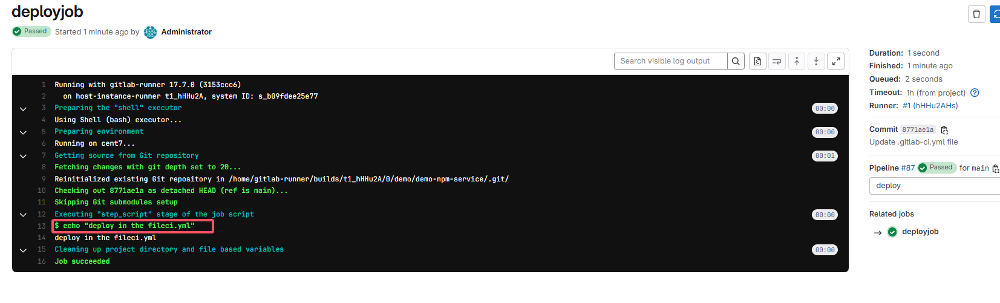

覆盖和合并的处理逻辑应该类似local

### 14.3 include:template - 只能使用官方提供的末班
https://gitlab.com/gitlab-org/gitlab/tree/master/lib/gitlab/ci/templates
```
include:
  - template: JobTemplate.gitlab-ci.yml
```
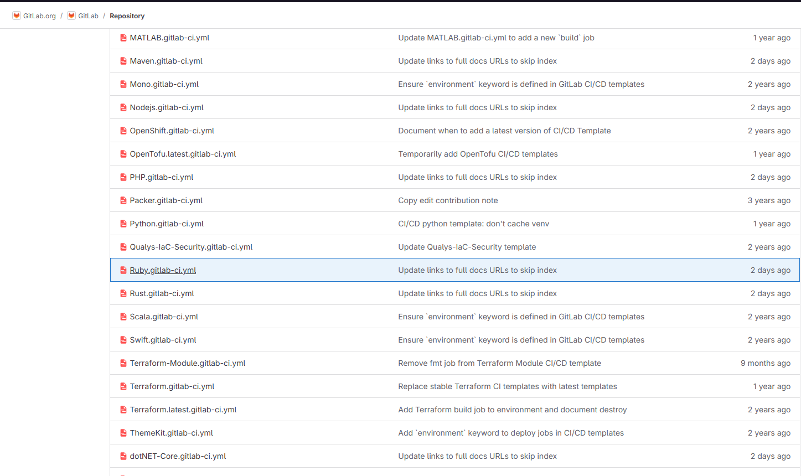


### 14.4 include:remote - 引入远程仓库的文件
用于通过HTTP/HTTPS包含来自其他位置的文件，并使用完整URL进行引用。远程文件必须可以通过简单的GET请求公开访问，因为不支持远程URL中的身份验证架构
```
include:
  - remote: 'https://gitlab.com/gitlab-org/gitlab-foss/-/raw/master/lib/gitlab/ci/templates/JobTemplate.gitlab-ci.yml'
```
* 注意引用的是raw文件，不是简单的拷贝gitlab文件的浏览器地址栏的url

**案例：使用remote将file中引入的文件通过remote引入**
**ci/fileci.yml**
```
# ci/fileci.yml
deployjob:
  stage: deploy
  script: echo "deploy in the fileci.yml"
```
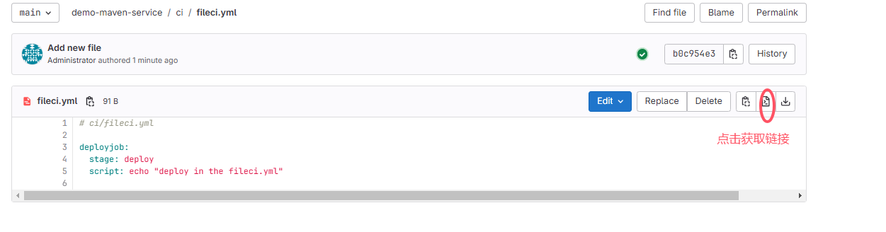

**.gitlab-ci.yml**
```
stages:
  - build
  - test
  - deploy

include:
  - remote: 'http://192.168.50.130:9000/demo/demo-maven-service/-/raw/main/ci/fileci.yml'
  
module-a-build:
  stage: build
  script:
    - echo "hello3a"
    - sleep 10

module-b-build:
  stage: build
  script:
    - echo "hello3b"
    - sleep 20

module-a-test:
  stage: test
  script:
    - echo "hello3a"
    - sleep 5
  needs: ["module-a-build"]

module-b-test:
  stage: test
  script:
    - echo "hello3b"
    - sleep 5
  needs: ["module-b-build"]
```

* 暂未调通，待解决；总是提示include的remote yml无效

### 14.5 补充知识点，gitlab-ci.yml自定义
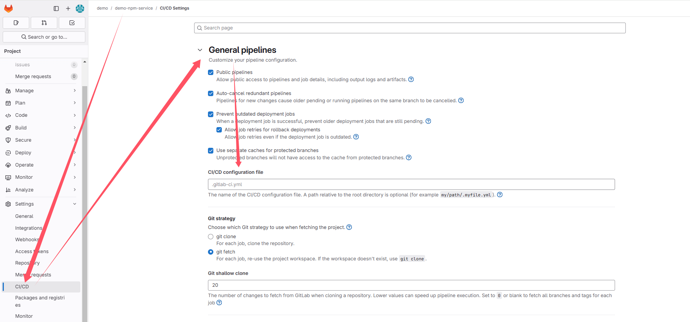
* 默认是.gitlab-ci.yml，也可以自定义，比如：.gitlab-ci-custom.yml

## 15. extends
```
yamlCopy
.tests:
  script: mvn test
  stage: test
  only:
    refs:
      - tags

testjob:
  extends: .tests
  script: mvn clean test
  only:
    variables:
      - $RSPEC
```
* .tests相当于模板作业，`extends: .tests`相当于继承模板作业，如果有相同部分则可以覆盖模板作业中的配置，即继承不同的，覆盖相同的

**案例**
```
stages:
  - test

variables:
  GIT_STRATEGY: clone
  GIT_DEPTH: 0
  GIT_CLEAN_FLAGS: '-ffdx'
  TST: 'TEST'

.tests:
  script: echo "mvn test"
  stage: test
  only:
    refs:
      - branches # 只有当代码推送到分支时，这个作业才会被触发

testjob:
  extends: .tests
  script: echo "mvn clean test"
  only:
    variables:
      - $TST # 只有当变量 TST 被定义时，这个作业才会被触发
```
* testjob继承了.tests作业，但是覆盖了script脚本，所以执行testjob作业时，会执行`echo "mvn clean test"`

* 合并后的pipieline job如下
```
testjob:
  extends: .tests
  script: echo "mvn clean test"
  only:
    variables:
      - $TST
    refs:
      - branches
```

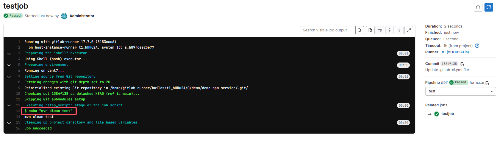

### 15.1 extends & include
二者的混用

## 16. trigger
* 当GitLab从trigger定义创建的作业启动时，将创建一个下游管道
* 允许创建多项目管道和子管道
* 将trigger与when:manual一起使用会导致错误
* **多项目管道**：**跨多个项目**设置流水线，以便一个项目中的管道可以触发另一个项目中的管道【微服务架构】
* **父子管道**：在**同一项目**中管道可以触发一组同时运行的子管道，子管道仍然按照阶段顺序执行其每个作业，但是可以自由地继续执行各个阶段，而不必等待父管道中无关的作业完成。f父子管道可以并行运行

### 16.1 多项目管道
当前面阶段运行完成后，触发demo/demo-maven-service项目main流水线。创建上游管道的用户需要具有对下游项目的访问权限。如果发现下游项目用户没有访问权限以在其中创建管道，则staging作业将被标记为失败。
```
staging:
  variables:
    ENVIRONMENT: staging # 这个变量将可以传递到下游项目
  stage: deploy 
  trigger:
    project: demo/demo-java-service
    branch: main
    strategy: depend
```
project 关键字，用于指定下游项目的完整路径。该 branch 关键字指定由指定的项目分支的名称。使用 variables 关键字将变量传递到下游管道。全局变量也会传递给下游项目。上游管道优先于下游管道。如果在上游和下游项目中定义了两个具有相同名称的变量，则在上游项目中定义的变量将优先。默认情况下，一旦创建下游管道，trigger 作业就会以 success 状态完成。strategy: depend 将自身状态从触发的管道合并到源作业(???)。


**案例**：在demo/demo-npm-service中触发demo/demo-maven-service的branch ci流水线

* gitlab-ci.yml in demo/demo-npm-service
```
stages:
  - deploy

staging:
  variables:
    ENVIRONMENT: staging
  stage: deploy
  trigger:
    project: demo/demo-maven-service
    branch: ci
    #strategy: depend

```

* gitlab-ci.yml in demo/demo-maven-service
```
stages:
  - deploy

variables:
  GIT_STRATEGY: clone
  GIT_DEPTH: 0
  GIT_CLEAN_FLAGS: '-ffdx'
  
deployjob:
  stage: deploy
  script: 
    - echo "running in the demo-maven-service"
    - sleep 20
```
* 可以看到，即使下游pipeline没有成功，但是上游的pipeline已经成功；如果要使上游的pipeline等待下游的pipeline成功，则需要在trigger中添加strategy: depend

* 在demo-npm-service中添加strategy: depend后，可以看到上游的pipeline在等待下游的pipeline成功
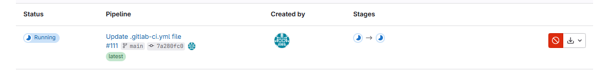

* demo-npm-service的pipeline
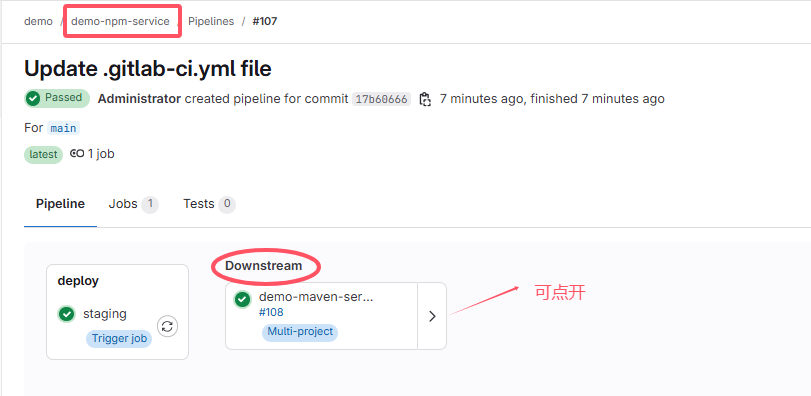

* demo-maven-service的pipeline
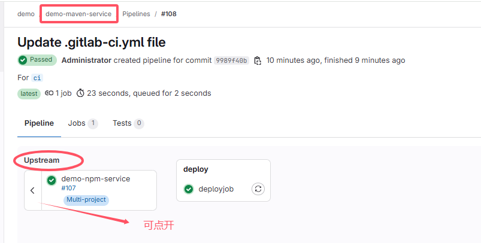


### 16.2 父子管道
* 在同一个项目中

ci/child01.yml
```
stages:
  - build

child-a-build:
  stage: build
  script:
    - echo "child a pipiline"
    - sleep 15
```
.gitlab-ci.yml
```

stages:
  - deploy
  - build
variables:
  GIT_STRATEGY: clone
  GIT_DEPTH: 0
  GIT_CLEAN_FLAGS: '-ffdx'
buildjob:
  stage: build
  script:
    - echo "run build job in parent"
    - sleep 15
staging:
  variables:
    ENVIRONMENT: staging
  stage: deploy
  trigger:
    include: 'ci/child01.yml'
    strategy: depend
```
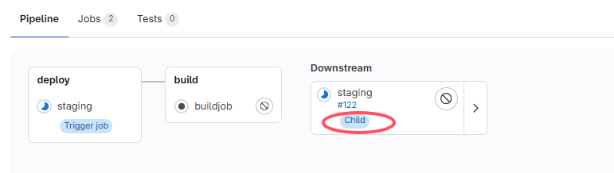

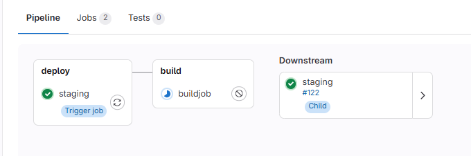

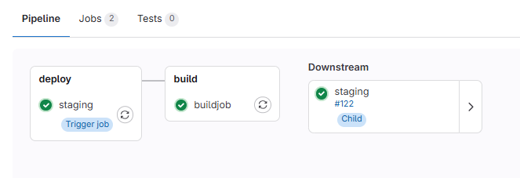

* 在同一个项目中，父管道要等待子管道结束才执行，需要在父管道的trigger中添加strategy: depend
* 如果不加strategy: depend，父管道会先执行，子管道会并行执行
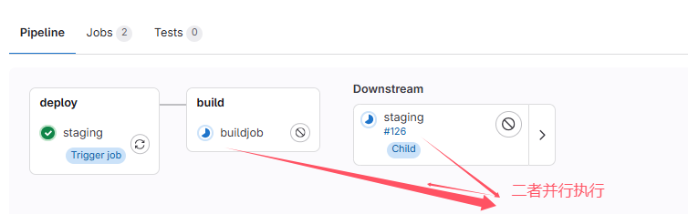


## 17. images
* 默认在注册runner的时候需要填写一个基础的镜像，请记住一点只要使用执行器为docker类型的runner，所有的操作运行都会在容器中运行
* job image优先级高于全局image

### 17.1 默认image
```
stages:
  - build
  - deploy

image: maven:3.6.3-jdk-8

variables:
  GIT_STRATEGY: clone
  GIT_DEPTH: 0
  GIT_CLEAN_FLAGS: '-ffdx'

buildjob:
  stage: build
  tags:
    - dockerdemo
  script:
    - echo "run build job"
    - sleep 15
```
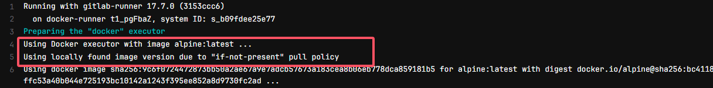
* 没有指定image时，默认使用docker excuetor注册时指定的image

### 17.2 全局image
```
stages:
  - build
  - deploy

image: maven:3.6.3-jdk-8

variables:
  GIT_STRATEGY: clone
  GIT_DEPTH: 0
  GIT_CLEAN_FLAGS: '-ffdx'

buildjob:
  stage: build
  tags:
    - dockerdemo
  script:
    - echo "run build job"
    - sleep 15

deployjob:
  stage: deploy
  tags:
    - dockerdemo
  script:
    - echo "run deploy job"
    - sleep 15
```
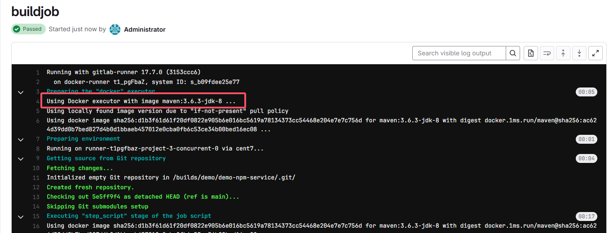

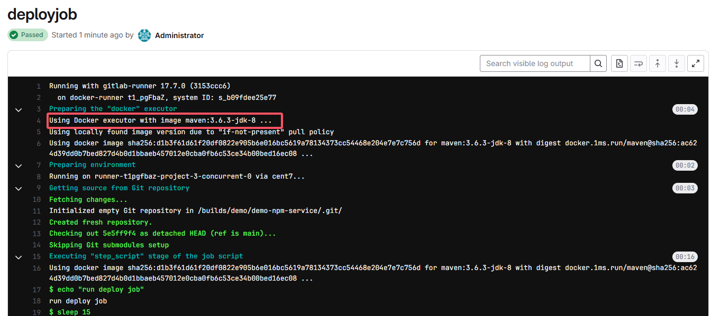

* buildjob和deployjob都使用了全局image,maven:3.6.3-jdk-8

### 17.3 job指定image
* buildjob指定了image
* deployjob没有指定image
```
stages:
  - build
  - deploy

#image: maven:3.6.3-jdk-8

variables:
  GIT_STRATEGY: clone
  GIT_DEPTH: 0
  GIT_CLEAN_FLAGS: '-ffdx'

buildjob:
  image: maven:3.6.3-jdk-8
  stage: build
  tags:
    - dockerdemo
  script:
    - echo "run build job"
    - sleep 15

deployjob:
  stage: deploy
  tags:
    - dockerdemo
  script:
    - echo "run deploy job"
    - sleep 15
```
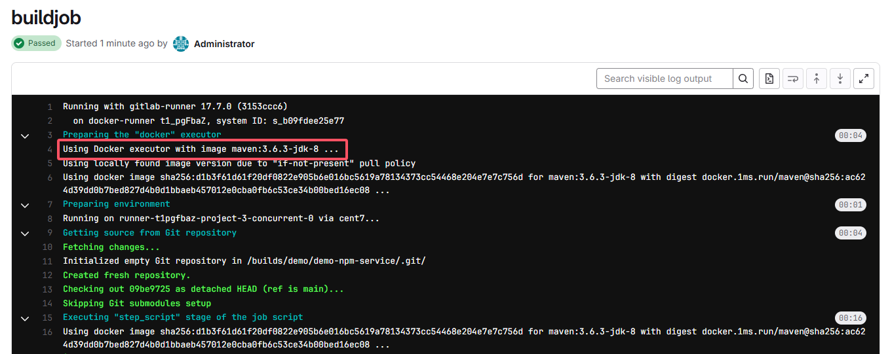

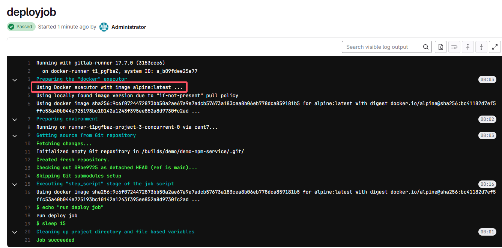

* buildjob指定了image，使用maven:3.6.3-jdk-8, deployjob没有指定image，使用docker executor注册时指定的image

### 17.4 job image和全局image同时存在
* job image优先级高于全局image
```
stages:
  - build
  - deploy

image: maven:3.6.3-jdk-8

variables:
  GIT_STRATEGY: clone
  GIT_DEPTH: 0
  GIT_CLEAN_FLAGS: '-ffdx'

buildjob:
  image: alpine
  stage: build
  tags:
    - dockerdemo
  script:
    - echo "run build job"
    - sleep 15
```
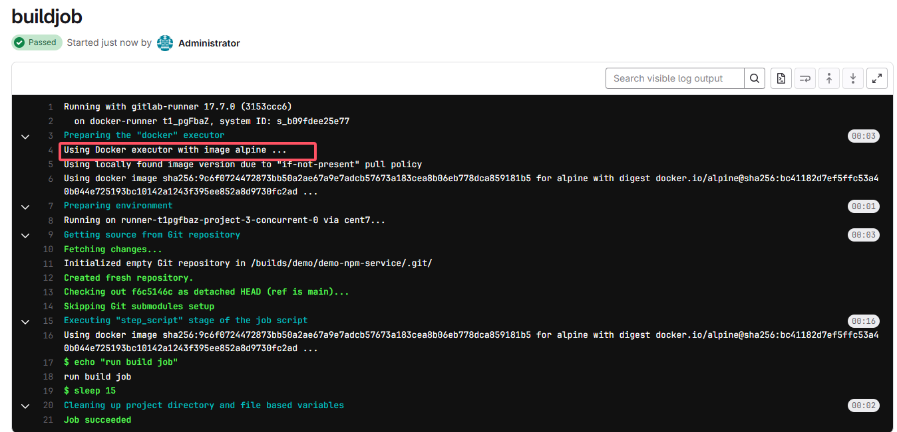
* 全局image是maven:3.6.3-jdk-8，buildjob的image是alpine，所以buildjob使用alpine, job image优先级更高

## 18. services
工作期间运行的另一个Docker映像，并link到 image 关键字定义的Docker映像。这样，就可以在构建期间访问服务映像。

服务映像可以运行任何应用程序，但是最常见的用例是运行数据库容器，例如 mysql 。与每次安装项目时都安装 mysql 相比，使用现有映像并将其作为附加容器运行更容易，更快捷。

**案例**：
```
stages:
  - build
  - deploy

#image: maven:3.6.3-jdk-8

variables:
  GIT_STRATEGY: clone
  GIT_DEPTH: 0
  GIT_CLEAN_FLAGS: '-ffdx'

services:
  - name: mysql:latest
    alias: mysql-01

buildjob:
  stage: build
  tags:
    - dockerdemo
  script:
    - echo "run build job"
    - sleep 15

deployjob:
  stage: deploy
  tags:
    - dockerdemo
  script:
    - echo "run deploy job"
    - sleep 15
```
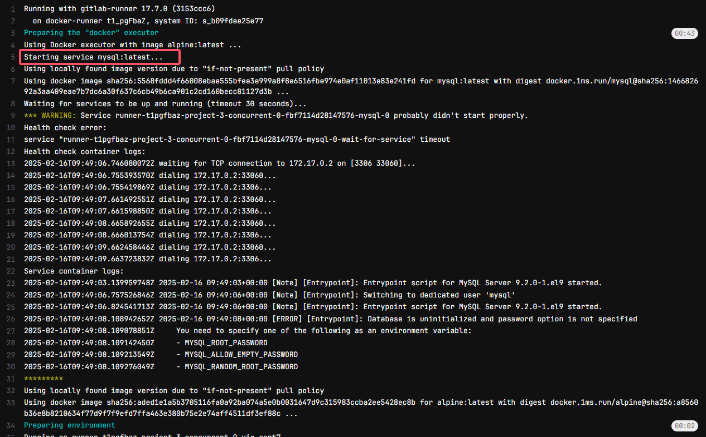

## 19. environment
```
stages:
  - build
  - deploy

#image: maven:3.6.3-jdk-8

variables:
  GIT_STRATEGY: clone
  GIT_DEPTH: 0
  GIT_CLEAN_FLAGS: '-ffdx'

buildjob:
  stage: build
  tags:
    - dockerdemo
  script:
    - echo "run build job"
    - sleep 15

deployjob:
  stage: deploy
  tags:
    - dockerdemo
  script:
    - echo "run deploy job"
    - sleep 15
  environment:
    name: staging
    url: https://www.baidu.com # 可以替换为实际环境的url
```
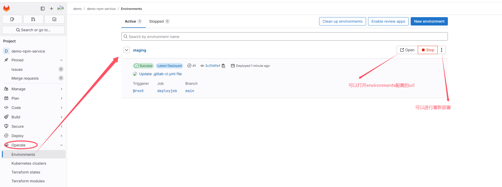
* redeploy会再次触发整个pipeline

## 20. inherit
* 使用或禁用全局定义的环境变量或默认值


## issues
### job总是执行失败，报如下错误
Description:
```
fatal: git fetch-pack: expected shallow list
fatal: The remote end hung up unexpectedly
```

Solution:
```
variables:
  GIT_STRATEGY: clone
  GIT_DEPTH: 0
  GIT_CLEAN_FLAGS: '-ffdx'

before_script: # optional
  - git reset --hard
  - git clean -ffdx
```

