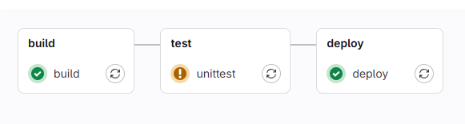
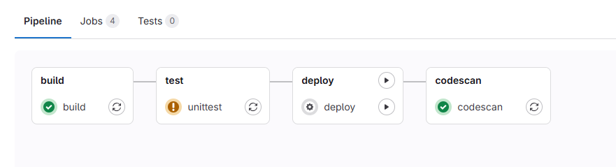
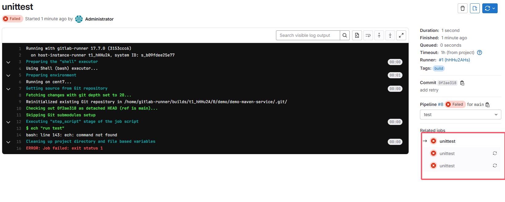
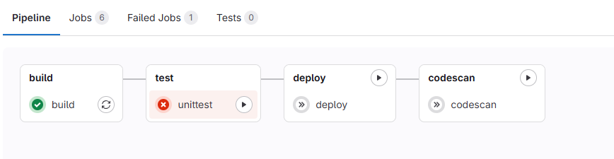
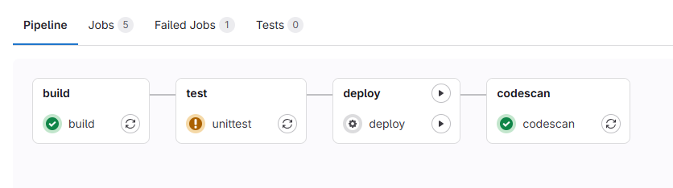
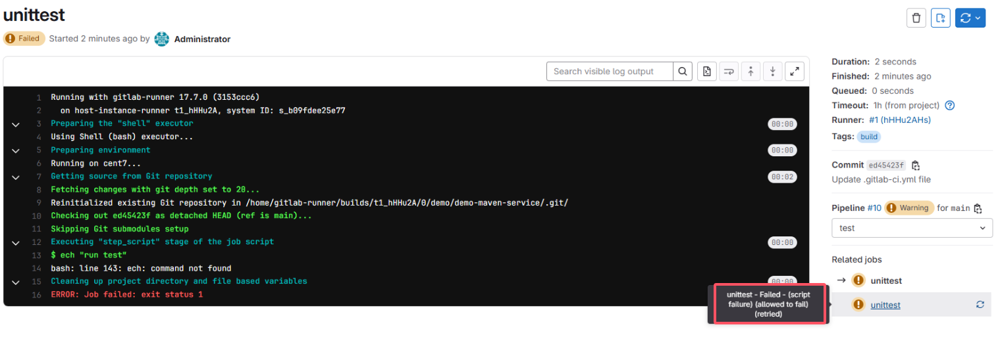
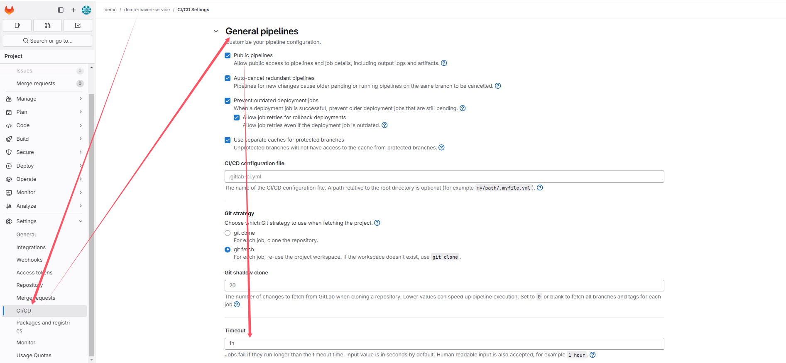
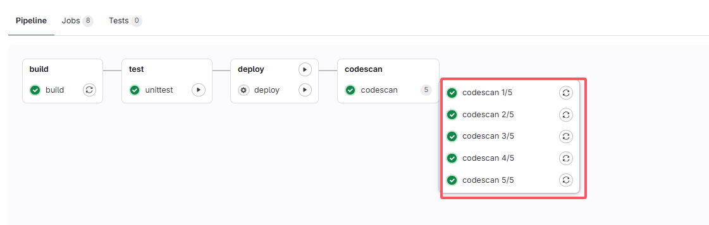
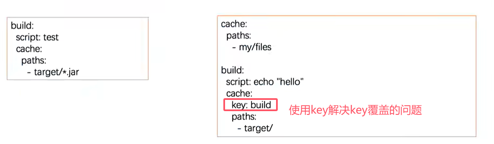
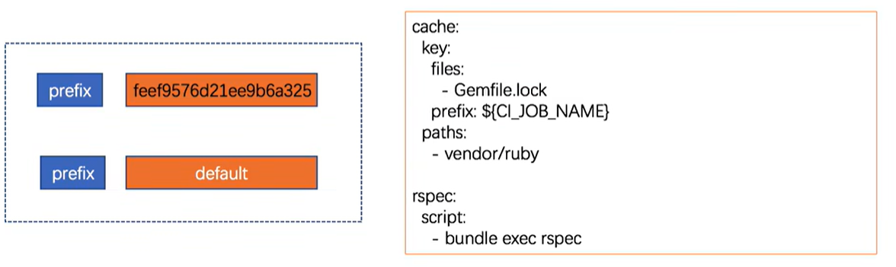

# pipeline syntax

常用语法
* tags
* alllow_failure
* when
* retry
* timeout
* parallel
* only
* except
* rules
* workflow

## 1 tags
让job在指定runner上运行;通过这种方式，可以让job在不同的平台上运行，比如Windows、Linux、Mac等

```
build:
  stage: build
  tags:
    - build
  only: # limit the branch
    - main
  script:
    - echo "maven clean"
    - echo "maven install"
```

## 2 alllow_failure
allow_failure 允许作业失败，默认值为 false。启用后，如果作业失败，该作业将在用户界面中显示橙色警告。但是，管道的逻辑流程将认为作业成功/通过，并且不会被阻塞。假设所有其他作业均成功，则该作业的阶段及其管道将显示相同的橙色警告。但是，关联的提交将被标记为“通过”，而不会发出警告
* 如果后面有job的when条件为on_success，即使该job失败了，也不影响后面when为on_success的job执行

```
stages:
  - build
  - test
  - deploy

build:
  stage: build
  tags:
    - build
  only: # limit the branch
    - main
  script:
    - echo "maven clean"
    - echo "maven install"

unittest:
  stage: test
  tags: 
    - build
  script:
    - ech "run test"
  allow_failure: true

deploy:
  stage: deploy
  tags:
    - deploy
  only:
    - main
  script:
    - echo "hello deploy"
```



## 3 when
控制作业的执行

* on_success 前面阶段中的所有作业都成功时才执行作业，默认值。

* on_failure 当前面阶段出现失败时执行。

* always 总是执行作业。

* manual 手动执行作业。

* delayed 延迟执行作业。


```
stages:
  - build
  - test
  - deploy
  - codescan

build:
  stage: build
  tags:
    - build
  only: # limit the branch
    - main
  script:
    - echo "maven clean"
    - echo "maven install"

unittest:
  stage: test
  tags: 
    - build
  script:
    - ech "run test"
  when: delayed
  start_in: "10"
  allow_failure: true

deploy:
  stage: deploy
  tags:
    - deploy
  only:
    - main
  script:
    - echo "hello deploy"
  when: manual

codescan:
  stage: codescan
  tags:
    - deploy
  only:
    - main
  script:
    - echo "codescan"
    - sleep 5
  when: on_success

```

* deploy需要手动执行


## 4 retry

* 配置在失败的情况下重试作业的次数。

* 当作业失败并配置了 retry，将再次处理该作业，直到达到 retry 关键字指定的次数。

* 如果 retry 设置为 2，并且作业在第二次运行成功（第一次重试），则不会再次重试。retry 值必须是一个正整数，等于或大于 0，但小于或等于 2（最多两次重试，总共运行 3 次）

```
stages:
  - build
  - test
  - deploy
  - codescan

build:
  stage: build
  tags:
    - build
  only: # limit the branch
    - main
  script:
    - echo "maven clean"
    - echo "maven install"

unittest:
  stage: test
  tags: 
    - build
  script:
    - ech "run test"
  when: delayed
  start_in: "10"
  allow_failure: false
  retry: 2

deploy:
  stage: deploy
  tags:
    - deploy
  only:
    - main
  script:
    - echo "hello deploy"
  when: manual

codescan:
  stage: codescan
  tags:
    - deploy
  only:
    - main
  script:
    - echo "codescan"
    - sleep 5
  when: on_success
```




失败后，后面的job不会执行




## 5 retry-重试-精确匹配错误

默认情况下，在失败情况下重试作业。max：最大重试次数， when：重试失败的错误类型
* always：在发生任何故障时重试（默认）。

* unknown_failure：当失败原因未知时。

* script_failure：脚本失败时重试。

* api_failure：API失败重试。

* stuck_or_timeout_failure：作业卡住或超时时。

* runner_system_failure：运行系统发生故障。

* missing_dependency_failure：如果依赖丢失。

* runner_unsupported：Runner不受支持。

* stale_schedule：无法执行延迟的作业。

* job_execution_timeout：脚本超出了为作业设置的最大执行时间。

* archived_failure：作业已存档且无法运行。

* unmet_prerequisites：作业未能完成先决条件任务。

* scheduler_failure：调度程序未能将作业分配给运行scheduler_failure。

* data_integrity_failure：检测到结构完整性问题。

```
stages:
  - build
  - test
  - deploy
  - codescan

build:
  stage: build
  tags:
    - build
  only: # limit the branch
    - main
  script:
    - echo "maven clean"
    - echo "maven install"

unittest:
  stage: test
  tags: 
    - build
  script:
    - ech "run test"
  when: delayed
  start_in: "5"
  allow_failure: true
  retry:
    max: 1
    when: script_failure

deploy:
  stage: deploy
  tags:
    - deploy
  only:
    - main
  script:
    - echo "hello deploy"
  when: manual

codescan:
  stage: codescan
  tags:
    - deploy
  only:
    - main
  script:
    - echo "codescan"
    - sleep 5
  when: on_success
```






## 6 timeout

作业级别(job)的超时可以超过项目级别的超时，但不能超过Runner特定的超时

* 作业级别的超时
```
build:
    stage: build
    script:
        - echo "build"
        - sleep 10
    timeout: 1 hour 10 minutes
```

* 项目级别的超时




## 7 parallel - 并行作业

* 配置要并行运行的作业实例数，此值必须大于或等于 2 并且小于或等于 50。

* 这将创建 N 个并行运行的同一作业实例。它们从 job_name 1/N 到 job_name N/N 依次命名。

```
stages:
  - build
  - test
  - deploy
  - codescan

build:
  stage: build
  tags:
    - build
  only: # limit the branch
    - main
  script:
    - echo "maven clean"
    - echo "maven install"

unittest:
  stage: test
  tags: 
    - build
  script:
    - echo "run test"
  when: delayed
  start_in: "5"
  allow_failure: true
  retry:
    max: 1
    when: script_failure

deploy:
  stage: deploy
  tags:
    - deploy
  only:
    - main
  script:
    - echo "hello deploy"
  when: manual

codescan:
  stage: codescan
  tags:
    - deploy
  only:
    - main
  script:
    - echo "codescan"
    - sleep 5
  when: on_success
  parallel: 5
```



## 8 only & except - 限制分支标签
only 和 except 用分支策略来限制 jobs 构建：

* only 定义哪些分支和标签的 git 项目将会被 job 执行。

* except 定义哪些分支和标签的 git 项目将不会被 job 执行。

```
job:
    # use regexp
    only:
        - /^issue-.*$/
    # use specicial keywords
    except:
        - branches
```

only & except案例
```
stages:
  - build
  - test
  - deploy
  - codescan

build:
  stage: build
  tags:
    - build
  only: # limit the branch
    - main
  script:
    - echo "maven clean"
    - echo "maven install"

unittest:
  stage: test
  tags: 
    - build
  except:
    - develop
    - devlop
  script:
    - echo "run test"
  when: delayed
  start_in: "5"
  allow_failure: true
  retry:
    max: 1
    when: script_failure

deploy:
  stage: deploy
  tags:
    - deploy
  only:
    - main
  script:
    - echo "hello deploy"
  when: manual

codescan:
  stage: codescan
  tags:
    - deploy
  only:
    - main
  script:
    - echo "codescan"
    - sleep 5
  when: on_success
  parallel: 5
```

## 8 rules - 构建规则

* rules允许按顺序评估单个规则，直到找到一个匹配的规则。
* rules不能与only和except同时使用

可用的规则
* if 如果条件匹配
* changes 指定文件发生改变
* exists 指定文件存在

### 8.1 rules - if - 条件匹配
* rules是一个数组，定义系列规则
* 如果条件匹配，则执行作业

only语句可以替换为rules语句，比如
```
only:   
    - main
```
可以替换为
```
rules:
    - if: '$CI_COMMIT_REF_NAME == "main"'
```
* 这里CI_COMMIT_REF_NAME是内置变量吗？需要掌握常见的内置变量
* 内置变量：https://docs.gitlab.com/ee/ci/variables/predefined_variables.html

**案例：**

```
variables:
  DOMAIN: example.com

codescan:
  stage: codescan
  tags:
    - build
  script:
    - echo "codescan"
    - sleep 5
  #parallel: 5
  rules:
    - if: '$DOMAIN == "example.com"'
      when: manual
    - when: on_success
```
* 如果DOMAIN的值匹配，则需要手动执行
* 不匹配on_success，默认规则
* 条件判断从上到下，匹配即停止
* 多条条件匹配可以使用&&，||

**案例：** 把only修改为rules if
* only
```
stages:
  - build
  - test
  - deploy
  - codescan

# FIX issue:
  # fatal: git fetch-pack: expected shallow list
  # fatal: The remote end hung up unexpectedly
variables:
  GIT_DEPTH: 0
  GIT_CLEAN_FLAGS: '-ffdx'

# clean the repository in the before_script section(alternative)
#before_script:
#  - git reset --hard
#  - git clean -ffdx

build:
  stage: build
  tags:
    - build
  only: # limit the branch
    - main
  script:
    - echo "maven clean"
    - echo "maven install"

unittest:
  stage: test
  tags: 
    - build
  except:
    - develop
    - devlop
  script:
    - echo "run test"
  when: delayed
  start_in: "5"
  allow_failure: true
  retry:
    max: 1
    when: script_failure

deploy:
  stage: deploy
  tags:
    - deploy
  only:
    - main
  script:
    - echo "hello deploy"
  when: manual

codescan:
  stage: codescan
  tags:
    - deploy
  only:
    - main
  script:
    - echo "codescan"
    - sleep 3
  when: on_success
  parallel: 3
```
* rules-if
```
stages:
  - build
  - test
  - deploy
  - codescan

# FIX issue:
  # fatal: git fetch-pack: expected shallow list
  # fatal: The remote end hung up unexpectedly
variables:
  GIT_DEPTH: 0
  GIT_CLEAN_FLAGS: '-ffdx'

# clean the repository in the before_script section(alternative)
#before_script:
#  - git reset --hard
#  - git clean -ffdx

build:
  stage: build
  tags:
    - build
  rules:
    - if: '$CI_COMMIT_REF_NAME == "main"'
  script:
    - echo "maven clean"
    - echo "maven install"

unittest:
  stage: test
  tags: 
    - build
  except:
    - develop
    - devlop
  script:
    - echo "run test"
  when: delayed
  start_in: "5"
  allow_failure: true
  retry:
    max: 1
    when: script_failure

deploy:
  stage: deploy
  tags:
    - deploy
  rules:
    - if: '$CI_COMMIT_REF_NAME == "main"'
  script:
    - echo "hello deploy"
  when: manual

codescan:
  stage: codescan
  tags:
    - deploy
  rules:
    - if: '$CI_COMMIT_REF_NAME == "main"'
  script:
    - echo "codescan"
    - sleep 3
  when: on_success
  parallel: 3
```

**案例：** 综合案例
* 可以在project级别，也可以在job级别，通过variables定义变量
* 在某个job中定义的变量，无法在另一个job中访问到，比如这里的MY_VARIABLE
* prechecking job的逻辑
```
stages:
  - prechecking
  - test

# FIX issue:
  # fatal: git fetch-pack: expected shallow list
  # fatal: The remote end hung up unexpectedly
variables:
  GIT_DEPTH: 0
  GIT_CLEAN_FLAGS: '-ffdx'

# clean the repository in the before_script section(alternative)
#before_script:
#  - git reset --hard
#  - git clean -ffdx

prechecking:
  stage: prechecking
  tags:
    - build
  variables:
    MY_VARIABLE: "default branch"
  rules:
    - if: '$CI_COMMIT_REF_NAME == "main"'
      variables:
        MY_VARIABLE: "main"
    - when: on_success
  script:
    - echo "$MY_VARIABLE"

unittest:
  stage: test
  tags: 
    - build
  except:
    - devlop
  script:
    - echo "$MY_VARIABLE"
    - echo "run test"
  when: delayed
  start_in: "5"
  allow_failure: true
  retry:
    max: 1
    when: script_failure
```


### 8.2 rules - changes - 指定文件发生改变
* 接收内容为文件路径的数组
* 如果文件发生改变，则执行作业
```
rules:
  - changes:
      - README.md
      - CHANGELOG.md
```

### 8.3 rules - exists - 指定文件存在
* 接收内容为文件路径的数组
* 如果文件存在，则执行作业
```
rules:
  - exists:
      - README.md
      - CHANGELOG.md
```

**案例：**
```
stages:
  - prechecking

# FIX issue:
  # fatal: git fetch-pack: expected shallow list
  # fatal: The remote end hung up unexpectedly
variables:
  GIT_DEPTH: 0
  GIT_CLEAN_FLAGS: '-ffdx'

# clean the repository in the before_script section(alternative)
#before_script:
#  - git reset --hard
#  - git clean -ffdx

prechecking:
  stage: prechecking
  tags:
    - build
  rules:
    - exists: 
      - Dockerfile
  script:
    - echo “prechecking”
```

### 8.4 rules - allow_failure
* allow_failure: true, 允许作业失败，不影响后续的作业


## 9. workflow - rules - 管道创建
* 顶级 workflow 关键字适用于整个管道，并将确定是否创建管道。

* when：可以设置为 always 或 never，如果未提供，则默认值为 always


## 10. cache
* 存储编译项目所需的运行时依赖项，指定项目工作空间中需要在 job 之间缓存的文件或目录。

* 全局 cache 定义在 job 之外，针对所有 job 生效。job 中的 cache 优先于全局


### 10.1 cache: paths
* 在 job build 中定义缓存，将会缓存 target 目录下的所有 .jar 文件。
* 当在全局定义了 cache:paths 时，会被 job 中的定义覆盖。以下实例将缓存 target 目录




### 10.2 cache:key - 缓存标记
* 为缓存做个标记，可以配置 job、分支为 key 来实现分支、作业特定的缓存。
* 为不同 job 定义了不同的 cache:key 时，会为每个 job 分配一个独立的 cache。
* cache:key 变量可以使用任何预定义变量，默认 default。
* 从 GitLab 9.0 开始，默认情况下所有内容都在管道和作业之间共享

按照分支设置缓存
```
cache:
  key: $(CI_COMMIT_REF_SLUG)
```

### 10.3 cache:key:files - 文件变化自动创建缓存
* files: 文件发生变化自动重新生成缓存（files 最多指定两个文件），提交的时候检查指定的文件。根据指定的文件生成密钥计算 SHA 校验和，如果文件(文件的md5值的名称)未改变值为 default

```
cache:
  key:
    files:
      - Gemfile.lock
      - package.json
  paths:
    - vendor/ruby
    - node_modules
```

### 10.4 cache:key:prefix - 组合生成校验和的前缀
* prefix：允许给定 prefix 的值与指定文件生成的密钥组合。
* 在这里定义了全局的 cache，如果文件发生变化则值为 rspec-xxx11111111222222，未发生变化为 rspec-default



### 10.5 cache:policy - 缓存策略
* 默认策略：pull-push在job开始执行时下载文件，并在结束时重新上传文件；这里的上传或下载是指gitlab-runner所运行的机器，比如下载就是从gitlab-runner所运行的机器下载
* policy: pull 在job开始执行时下载文件
* policy: push 在job结束时上传文件
* policy: pull-push 在job开始执行时下载文件，并在结束时重新上传文件


## 11. artifacts


## 12. dependencies


## 13. needs

## 14. include

## 15. extends

## 16. trigger

## 17. images

## 18. services


## 19. environment


## 20. template


## issues
### job总是执行失败，报如下错误
Description:
```
fatal: git fetch-pack: expected shallow list
fatal: The remote end hung up unexpectedly
```

Solution:
```
variables:
  GIT_DEPTH: 0
  GIT_CLEAN_FLAGS: '-ffdx'

before_script: # optional
  - git reset --hard
  - git clean -ffdx
```

