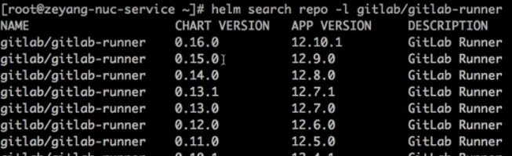
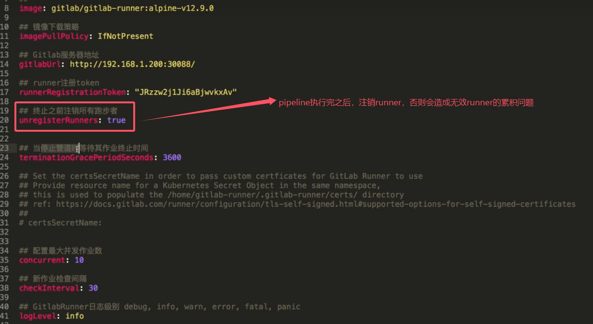

# Gitlab Runner安装

## 1. 安装方式

### 1.1 下载安装包
Gitlab Runner包下载地址：
* https://gitlab-runner-downloads.s3.amazonaws.com/latest/index.html
* 包括二进制、deb、rpm、源码等


https://gitlab-runner-downloads.s3.amazonaws.com/latest/binaries/gitlab-runner-linux-amd64
=>
下载指定版本，比如17.7版本
https://gitlab-runner-downloads.s3.amazonaws.com/v17.7.0/binaries/gitlab-runner-linux-amd64
* 这里的版本信息是，v17.7.0，不是v17.7，请注意

清华镜像站点：rpm包安装方式/或者yum源方式
https://mirrors.tuna.tsinghua.edu.cn/

但是可能无法下载最新的包


### 1.2 docker方式安装

### 1.3 k8s方式安装

## 2. rpm包安装
版本是17.7
https://gitlab-runner-downloads.s3.amazonaws.com/v17.7.0/rpm/gitlab-runner_amd64.rpm

* 下载包
```
wget https://gitlab-runner-downloads.s3.amazonaws.com/v17.7.0/rpm/gitlab-runner-helper-images.rpm
wget https://gitlab-runner-downloads.s3.amazonaws.com/v17.7.0/rpm/gitlab-runner_amd64.rpm
```

* 安装包
```
rpm -ivh gitlab-runner-helper-images.rpm
rpm -ivh gitlab-runner_amd64.rpm
``` 

* 启动 & 检查
```
gitlab-runner start
gitlab-runner status
```

## 3. k8s runner
### 3.1 安装helm
```
wget https://github.com/helm/helm/releases
tar -zxvf helm-v3.0.0-linux-amd64.tar.gz
mv linux-amd64/helm /usr/local/bin/helm
```
### 3.2 添加chart存储库
* 添加 gitlab chart存储库
```
helm repo add gitlab https://charts.gitlab.io
```
* 验证源
```
helm repo list
```

* 查询可以安装的gitlab-runner chart
```
helm search repo -l gitlab/gitlab-runner
```


### 3.3 更新配置信息
```
## 获取相关版本的chart包
# helm fetch gitlab/gitlab-runner --version=0.15.0
# ls
es
gitlab-runner-0.15.0.tgz
```
* 解压chart包, 可以更改values.yml实现自定义配置
* 如果不需要自定义配置，可以直接安装，不需要下载chart包，可以在安装的时候指定版本
* 注意values.yml中的一些配置
