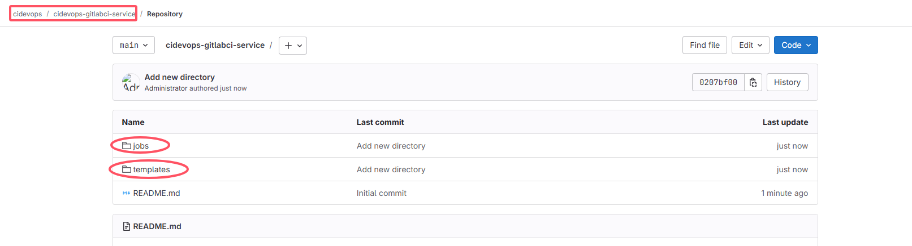
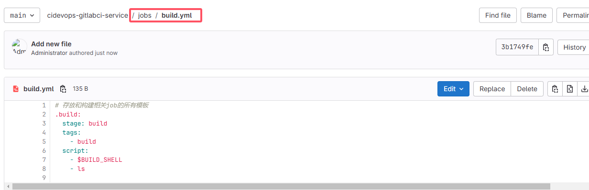
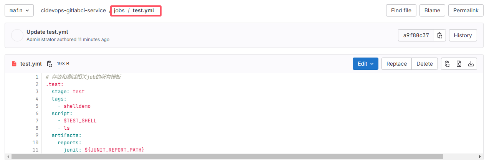
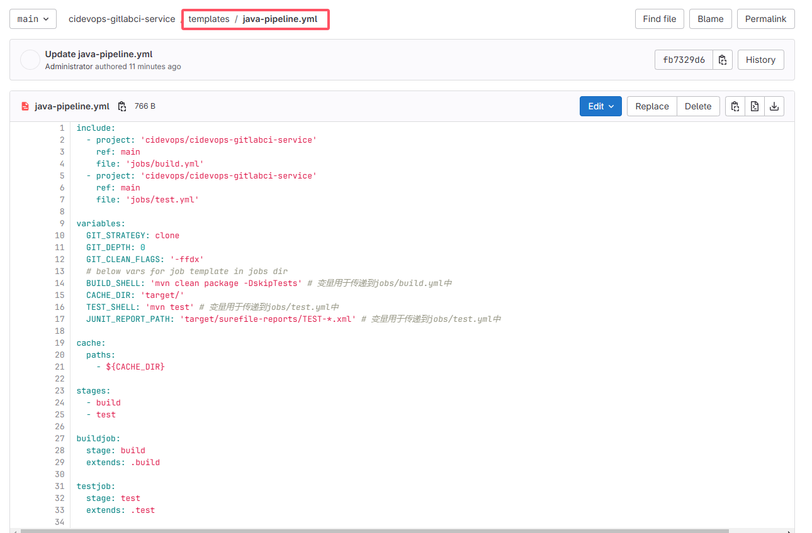
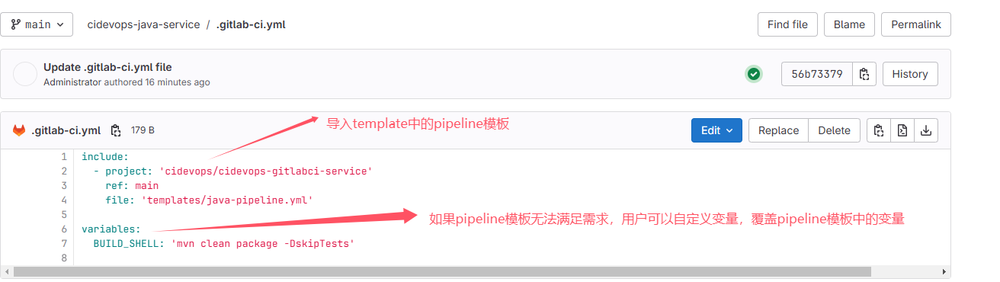
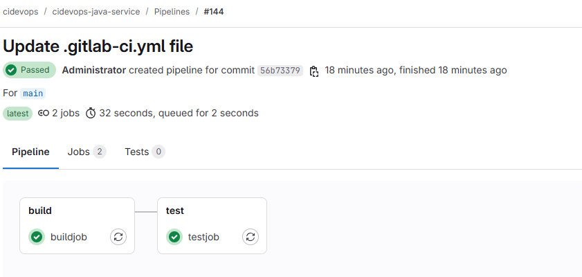
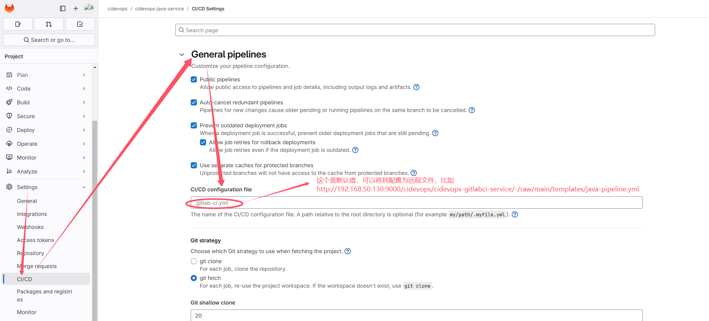

# template design

**核心设计：创建专门的仓库存放pipeline使用的job和template**
* 创建一个git仓库用于存放模板
* 创建一个template目录存放所有pipeline的模板
* 创建一个job目录存放job模板

这样就可以将一些maven、ant、gradle、npm工具通过一个job模板和不同的构建命令实现。**templates的好处是在其中定义了模板流水线，这些流水线可以直接让项目使用**。当遇到个性化项目的时候就可以在当前项目创建.gitlab-ci.yml文件来引用模板文件，再进一步实现个性化需要


## 1. 创建模板仓库
* 新建一个group，注意命名规范，最好和业务相关，这里名称cidevops
* 在cidevops下创建一个template仓库，注意命名规范，这里以group名称作为前缀，`cidevops-`



## 2. 工具链继承
* 后端项目maven集成
* 前端项目npm集成

### 2.1 后端项目maven集成
* 基础环境配置，比如安装maven，配置环境变量等
* 创建build作业模板

#### 2.1.1 创建build/test作业模板
* jobs目录存放的粒度是job template
* jobs/build.yml
```
# 存放和构建相关job的所有模板
.build:
  stage: build
  tags:
    - build
  script:
    - $BUILD_SHELL
    - ls
```


* jobs/test.yml
```
# 存放和测试相关job的所有模板
# 存放和测试相关job的所有模板
.test:
  stage: test
  tags:
    - shelldemo
  script:
    - $TEST_SHELL
    - ls
  artifacts:
    reports:
      junit: ${JUNIT_REPORT_PATH}
```


#### 2.1.2 创建pipeline模板
* templates/java-pipeline.yml
* pipeline模板是将jobs中的job template组合起来，形成一个完整的流水线，从而可以实现job template复用
```
include:
  - project: 'cidevops/cidevops-gitlabci-service'
    ref: main
    file: 'jobs/build.yml'
  - project: 'cidevops/cidevops-gitlabci-service'
    ref: main
    file: 'jobs/test.yml'

variables:
  GIT_STRATEGY: clone
  GIT_DEPTH: 0
  GIT_CLEAN_FLAGS: '-ffdx'
  # below vars for job template in jobs dir
  BUILD_SHELL: 'mvn clean package -DskipTests' # 变量用于传递到jobs/build.yml中
  CACHE_DIR: 'target/'
  TEST_SHELL: 'mvn test' # 变量用于传递到jobs/test.yml中
  JUNIT_REPORT_PATH: 'target/surefile-reports/TEST-*.xml' # 变量用于传递到jobs/test.yml中

cache:
  paths:
    - ${CACHE_DIR}

stages:
  - build
  - test

buildjob:
  stage: build
  extends: .build

testjob:
  stage: test
  extends: .test
```

* **在pipeline中定义变量，将变量传递到job template中**
* 也可以在pipeline中单独定义job，而不是从jobs目录中引用job template，可以灵活使用

### 2.2 项目应用——创建java项目
* .gitlab-ci.yml
```
include:
  - project: 'cidevops/cidevops-gitlabci-service'
    ref: main
    file: 'templates/java-pipeline.yml'

variables:
  BUILD_SHELL: 'mvn clean package -DskipTests'
```


* java项目成功地运行了pipeline中定义的build和test两个job



* 如果用户没有自定义需求，可以将pipeline模板的链接配置为默认的.gitlab-ci.yml，这样用户就不需要再创建.gitlab-ci.yml文件了



### 2.2 前端项目npm集成
类似于后端项目maven